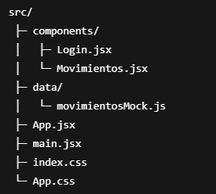

# Prueba Basica – Login y Movimientos (React)

Aplicación basica front-end desarrollada en **React + Vite** que simula un flujo básico de autenticación y visualización de movimientos financieros, orientada a un contexto fintech.

---

## 🚀 Tecnologías utilizadas.

- React
- Vite
- JavaScript (ES6+)
- CSS puro
- Node.js

---

## 📂 Estructura del proyecto.

---

## 🔐 Funcionalidad principal.

### Login.

* Formulario controlado con estado local.

* Validación básica de campos.

* Simulación de autenticación (sin backend).

### Movimientos.

* Carga simulada con useEffect.

* Datos mock de transacciones.

* Diferenciación visual entre ingresos y egresos

---

## ▶️ Instalación y ejecución.

1. Clonar el repositorio.

- git clone https://github.com/GianPi89/Prueba-Frontend-React.git

- cd Prueba_Frontend_React

2. Instalar dependencias.

- npm install

3. Ejecutar proyecto.

- npm run dev

### Abrir en el navegador: " http://localhost:5173 "

---

## 🧠 Decisiones técnicas

* Se utilizó mock data para simular una API.

* Arquitectura simple y legible.

* Componentes desacoplados.

* Flujo de autenticación manejado por estado global simple.

---

# 👤 Autor:

## Gian Pierre Martinez Otero.

---

# React + Vite

This template provides a minimal setup to get React working in Vite with HMR and some ESLint rules.

Currently, two official plugins are available:

- [@vitejs/plugin-react](https://github.com/vitejs/vite-plugin-react/blob/main/packages/plugin-react) uses [Babel](https://babeljs.io/) (or [oxc](https://oxc.rs) when used in [rolldown-vite](https://vite.dev/guide/rolldown)) for Fast Refresh
- [@vitejs/plugin-react-swc](https://github.com/vitejs/vite-plugin-react/blob/main/packages/plugin-react-swc) uses [SWC](https://swc.rs/) for Fast Refresh

## React Compiler

The React Compiler is not enabled on this template because of its impact on dev & build performances. To add it, see [this documentation](https://react.dev/learn/react-compiler/installation).

## Expanding the ESLint configuration

If you are developing a production application, we recommend using TypeScript with type-aware lint rules enabled. Check out the [TS template](https://github.com/vitejs/vite/tree/main/packages/create-vite/template-react-ts) for information on how to integrate TypeScript and [`typescript-eslint`](https://typescript-eslint.io) in your project.